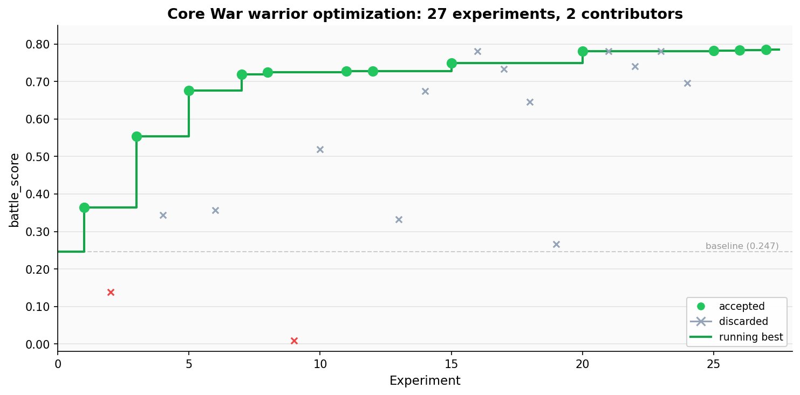

# Core War

Evolve a [Redcode](https://corewar.co.uk/icws94.txt) warrior that beats a frozen gauntlet of eight opponents. The editable surface is a single file: `warrior.red`.

## Demo run: 218% improvement over 27 experiments

We ran polyresearch on this example for 27 experiments using two contributor nodes on a single Hetzner dedicated server (18 cores / 36 threads). The chart below shows every experiment plotted by score, with the 12 accepted improvements highlighted in green and the running best drawn as a step function.



The full experiment log is in [results.tsv](results.tsv).

**What happened.** The baseline warrior was a one-instruction imp (`MOV 0, 1`) that scored 0.247 -- mostly draws, zero wins. The first experiments tried the obvious approach: DAT bombers. A single-process bomber immediately jumped to 0.364 by crushing the scanner and imp gate opponents, but lost to everything else. A dual-process bomber with two different step sizes pushed to 0.553 by winning the bomber-vs-bomber matchups.

The breakthrough came when one contributor switched to a paper (replicator) architecture. Papers copy themselves across the core, surviving bomber damage through redundancy. The first paper scored 0.677, beating 5 of 8 opponents. From there, improvements came through systematic optimization of two parameters: the copy count (how many instructions per replication) and the replication distance (how far apart copies are placed).

| Experiment | Score | What changed |
| --- | --- | --- |
| #1 | 0.364 | DAT bomber, step 2667 |
| #5 | 0.553 | Dual-process DAT bomber, offset 4000 |
| #2 | 0.677 | Paper replicator, distance 2667 |
| #15 | 0.719 | Paper distance optimized to 1741 via grid search |
| #18 | 0.725 | Distance 3457, grid searched 30+ distances |
| #16 | 0.750 | Copy count increased from 11 to 20 |
| #31 | 0.780 | Distance fine-tuned to 1751, dwarfmice 0.80 |
| #39 | 0.782 | Random sampling found distance 6942 |
| #41 | 0.784 | Random sampling found distance 3401 |
| #43 | 0.785 | Random sampling found distance 6599, final best |

The final warrior is an 8-instruction paper replicator scoring 0.785, with perfect 1.0 scores against the scanner and imp gate, and near-perfect scores against the dwarf (0.97) and stone (0.95) bombers. The remaining ceiling is the paper-vs-paper matchup: mice and rato both draw at ~0.33, and no paper variant broke that stalemate across 600+ evaluations.

**What we tried that did not work.**

- *Pure scanners* (0.14). Scanners beat papers in theory but are too slow and fragile against everything else in this gauntlet.
- *Hybrids* (0.36-0.49). Splitting cycles between bombing and replicating made both halves weaker. A dedicated paper always outperformed a paper that also bombed.
- *SPL bombs* (0.34). SPL bombs stun but do not kill, producing draws instead of wins.
- *Trap payloads* (0.55-0.74). Adding JMP/SPL/DAT traps to the copy payload slowed replication enough to lose bomber matchups.
- *Unrolled copy loops* (0.33). Without indirect addressing, each MOV copies the same source cell. The DJN-based loop is essential.
- *Silk-style SPL 0 fork* (0.36). Self-splitting creates thousands of zombie processes that starve the copy loop of cycles.
- *Alternative addressing modes*. MOV.F, MOV.X, DJN.A, and SPL.A all performed worse than the standard MOV.I / DJN.B / SPL.B combination.

**Takeaways.**

- *Papers dominate this gauntlet.* The gauntlet has 2 bombers, 3 papers, 1 scanner, 1 imp, and 1 imp gate. A paper beats bombers (2), draws papers (3), beats the scanner (1), beats the imp (1), and beats the imp gate (1). No other archetype covers as many matchups.
- *Distance is the most sensitive parameter.* Changing the replication distance by 10 cells can swing the score by 0.04. The fitness landscape is rugged with sharp peaks at specific distances (1751, 3401, 6599) separated by valleys. Random sampling found peaks that systematic sweeps missed.
- *Copy count has a sweet spot.* Copying 20 instructions per replication was optimal. Fewer copies (8-14) left the warrior too fragile against bombers. More copies (21+) slowed replication enough to lose dwarfmice matchups.
- *Paper-vs-paper is a hard ceiling.* Two mice-style papers filling the same core always stalemate. No parameter tuning, payload modification, or structural variant converted those draws to wins. Breaking this ceiling requires a fundamentally different warrior architecture.
- *Parallel contributors found different optima.* One contributor optimized around distance 1741-1751 (small positive steps). The other found 6599 (equivalent to backward steps of 1401). These are completely different regions of the search space that would not have been explored by a single contributor hill-climbing from one starting point.

## Getting started

```bash
.polyresearch/setup.sh            # one-time setup
.venv/bin/python .polyresearch/evaluate.py > run.log 2>&1
grep "^battle_score:" run.log     # parse the metric
```

The canonical protocol file for this repo is [POLYRESEARCH.md](POLYRESEARCH.md).

See [PREPARE.md](PREPARE.md) for full evaluation details and [PROGRAM.md](PROGRAM.md) for the research playbook.

## Why this is a good polyresearch example

**Evaluation is free and fast.** The simulator is pure Python, runs on any machine with no API keys, and finishes 800 deterministic battles in one to four minutes. Peer review costs nothing. A reviewer checks out the candidate, runs the evaluator, and gets the same number every time. This makes it easy to onboard new contributors without worrying about cost.

**The search space is large but the verification is cheap.** Redcode warriors can combine bombing, scanning, replication, imp launching, decoys, and process management in ways that interact non-obviously. A small change to a scan step or bomb pattern can flip matchups against multiple opponents. No single contributor is likely to explore every combination, and each new idea is cheap to verify.

**Rock-paper-scissors dynamics reward breadth.** Bombers beat scanners, replicators survive bombers, scanners kill replicators. The gauntlet includes all three plus imps, imp gates, and hybrids. A contributor who only thinks about bombing will plateau. Having multiple contributors with different mental models of Core War -- or different LLMs with different biases -- means more of the strategy space gets covered.

**Parallel search has a clear payoff.** The optional `evolve.py` tool runs an LLM-driven generate-and-mutate loop, evaluating every candidate against the full gauntlet. On a single machine this takes hours. The whole point is that ten machines running different seeds and mutation strategies for one hour will find better warriors than one machine running for ten hours. Polyresearch coordinates the results.
