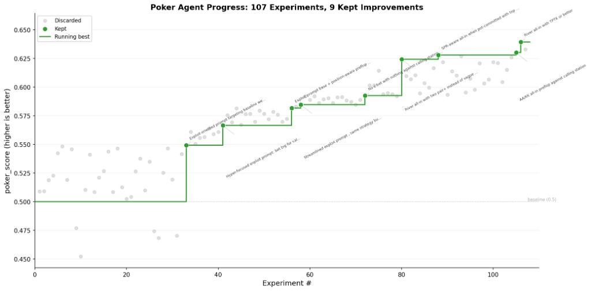

# Poker agent

Build a heads-up no-limit Texas Hold'em agent by writing a system prompt and optional tool implementations. The agent plays against a frozen baseline on a frozen duplicate-deal set. The editable surface is `system_prompt.md` and `tools/`.

This is a toy example. The agent is a bare LLM that picks poker actions from a system prompt, optionally calling into small Python tools. Nobody would build a competitive poker bot this way -- serious solvers use counterfactual regret minimization or deep RL with billions of self-play hands. The point is not to solve poker. It's to demonstrate how polyresearch coordinates a search over a two-dimensional editable surface (prompt + tools) using structured experiments, automated evaluation, and a monotonically improving baseline.

## Demo run: 28% improvement over 107 experiments

We ran polyresearch on this example for 107 experiments using a single lead agent. The chart below shows every experiment plotted by score, with the 9 accepted improvements highlighted in green and the running best drawn as a step function.



The full experiment log is in [results.tsv](results.tsv).

**What happened.** The first ~30 experiments tried conventional poker wisdom: preflop range charts, position-aware opening strategies, pot odds calculators, hand strength classifiers, and board texture analysis tools. Almost none of it moved the needle. Several tool-based approaches actually regressed below the 0.50 baseline, with the equity calculator being the worst offender (0.45).

The first real breakthrough came at experiment #35 when the agent switched to an exploit-oriented prompt that targeted the frozen baseline's specific weaknesses: bet large for value, stop multi-street bluffing, never slow-play. This jumped the score from 0.50 to 0.55 and set the direction for everything that followed.

From there, improvements came through iterative refinement of the exploit strategy:

| Experiment | Score | What changed                                       |
| ---------- | ----- | -------------------------------------------------- |
| #69        | 0.549 | Exploit-oriented prompt targeting baseline leaks   |
| #63        | 0.567 | Hyper-focused: bet big, no bluffs, no slow-play    |
| #50        | 0.582 | Added position-aware preflop ranges                |
| #86        | 0.593 | Streamlined prompt, stopped c-betting with nothing |
| #88        | 0.624 | River all-in with two pair or better               |
| #56        | 0.628 | SPR-aware all-in when pot-committed                |
| #96        | 0.630 | AA/KK all-in preflop against calling station       |
| #97        | 0.640 | River all-in with top pair, top kicker or better   |

**Takeaways.**

- *Exploit beats theory.* Playing "correct" poker against a fixed opponent is wasteful. The winning strategy was unapologetically exploitative: identify what the baseline does wrong and punish it.
- *Tools mostly failed.* Pot odds calculators, equity estimators, and hand strength classifiers all underperformed a well-tuned prompt. The LLM already has decent poker intuition; giving it calculators added latency and confusion without improving decisions.
- *Prompt compression helped.* Shorter prompts that stated clear rules outperformed longer prompts with nuanced guidance. The streamlined 367-token prompt beat the comprehensive strategy guide.
- *Most experiments fail, and that's fine.* Only 9 of 107 experiments were accepted. The 98 discarded runs are still useful data: they narrow the search space and confirm which directions are dead ends.

## Getting started

```bash
.polyresearch/setup.sh
python .polyresearch/evaluate.py > run.log 2>&1
grep "^poker_score:" run.log
```

The canonical protocol file for this repo is [../../POLYRESEARCH.md](../../POLYRESEARCH.md). This example relies on the root copy rather than shipping its own duplicate.

See [PREPARE.md](PREPARE.md) for full evaluation details and [PROGRAM.md](PROGRAM.md) for the research playbook.

## Why this is a good polyresearch example

**Two-dimensional search space.** Unlike the other examples where the editable surface is a single file, this one has two independent axes: the prompt and the tool suite. One contributor might focus entirely on prompt engineering -- better bet-sizing rules, clearer position awareness, tighter preflop discipline. Another might ignore the prompt and build a hand equity calculator or pot odds tool. A third might do both. These are different research directions that benefit from parallel exploration.

**Game-theoretic depth resists simple hill-climbing.** Poker is not a metric you can improve monotonically by tweaking one parameter. A strategy that exploits the baseline's weaknesses might itself be exploitable. Bet sizing, bluff frequency, and value extraction interact in ways that are hard to reason about from a prompt alone. Contributors with different intuitions about poker strategy will explore different parts of this space.

**Duplicate deals cancel luck.** Each deal is played twice with seats swapped, so the metric reflects decision quality rather than card distribution. Two reviewers evaluating the same candidate will see nearly identical results. This is what makes peer review meaningful -- you are comparing strategies, not comparing who got dealt pocket aces more often.

**The tool surface is open-ended.** The evaluator loads any `.json` + `.py` pair it finds in `tools/`. Contributors can add hand equity calculators, board texture classifiers, preflop lookup tables, pot odds helpers, or anything else that fits in pure Python under 50 KB. The constraint is lightweight but the design space is wide. Different contributors will build different toolsets and the experiment history will show which tools actually help.
