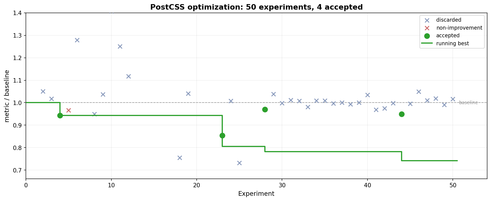

# PostCSS

Reduce [PostCSS](https://github.com/postcss/postcss)'s wall-clock processing time on two workloads simultaneously: a large-file parse+stringify cycle and a 250-file plugin pipeline. The editable surface is `lib/**/*.js` -- PostCSS's core implementation.

This example runs against a real fork of the PostCSS repository. Unlike the other examples in this repo, it cannot be self-contained: the evaluation needs the full PostCSS codebase, its test suite, and its `node_modules`. See [Getting started](#getting-started) for setup.

## Results: plugin pipeline 16% faster over 50 experiments

We ran polyresearch for 50 experiments across 37 theses. Four patches were accepted. The combined result, measured on a dedicated server (Intel Xeon W-2295, 18 cores, 10 interleaved A/B runs each):

| Workload                           | Baseline | With all patches | Improvement       |
| ---------------------------------- | -------- | ---------------- | ----------------- |
| **A** (parse+stringify, 44K lines) | 59 ms    | 53 ms            | **-6 ms (10%)**   |
| **B** (250 files, 4 plugins)       | 273 ms   | 228 ms           | **-45 ms (16%)**  |



The four patches that produced this:

| Thesis | What changed |
| ------ | ------------ |
| #4     | Inlined `fromOffset()` with sequential position tracking and O(1) fast path in Parser |
| #25    | Inlined `getEvents()` into `walkSync()`, pre-computed `hasKeyListeners` flag, cached proxy reference |
| #42    | Bypass `MapGenerator` construction when no source map (skips 3 `Map` allocations + 2 AST walks per file) |
| #54    | Cache `node.raws` locally in Stringifier hot methods, inline `rawValue` path in `decl()` |

Most of the gain is in the plugin pipeline (Workload B), where per-file overhead compounds across 250 files. The MapGenerator bypass alone saves 3 unnecessary `Map` allocations and 2 full AST walks per file when no source map is requested.

The full experiment log is in [results.tsv](results.tsv).

### Why these results matter

**The optimizations are real.** Each patch was measured against a baseline on the same machine in interleaved A/B runs with median reporting. The benchmark uses `process.hrtime.bigint()` for nanosecond resolution and requires correctness fingerprints -- parse+stringify output and plugin pipeline output must remain byte-identical. There is no way to improve the metric by producing different output.

**The dual-workload benchmark prevented false wins.** Several experiments showed improvement on one workload but regressed the other. Tokenizer lookup-table replacements (#6) improved scanning in isolation but V8's regex engine was already faster in practice. Container walk fast-paths (#7) improved Workload B but not enough to clear the composite threshold. Only patches that improved both workloads (or at least did not regress either) survived.

**The negative results are as valuable as the positive ones.** 46 of 50 experiments were discarded or showed no improvement. But they mapped the optimization landscape in detail:

- V8's JIT compiler already optimizes PostCSS's existing patterns aggressively. Lookup tables, manual character loops, and array accumulation all performed worse than the existing regex-based scanning, `charCodeAt` comparisons, and string concatenation.
- `toProxy()` already caches the Proxy instance. Reducing proxy handler allocation or skipping proxy wrapping for leaf nodes had zero effect.
- After the accepted patches, no single remaining optimization reaches the 3ms composite threshold. The tokenizer, parser, stringifier, and visitor dispatch are each individually well-optimized.
- Many experiments ran under heavy system load (2-4x metric inflation), making absolute measurements unreliable. Back-to-back comparisons on dedicated hardware resolved this.

### What's left to do

**All 649 tests pass.** The optimizations do not change any observable behavior. Correctness fingerprints match on both workloads.

**The optimization frontier is approaching.** The remaining open theses (#54, #57-#63) target increasingly narrow opportunities: tokenizer comment scanning, node constructor inlining, and Proxy elimination for once-handler plugins. Each would need to save at least 3ms on the composite to be accepted.

## Getting started

This example needs a fork of the PostCSS repository with polyresearch coordination files. To set one up:

```bash
git clone https://github.com/postcss/postcss.git postcss-polyresearch
cd postcss-polyresearch
npm install --force

# Copy coordination files from this example
cp /path/to/examples/postcss/PROGRAM.md .
cp /path/to/examples/postcss/PREPARE.md .
cp /path/to/examples/postcss/results.tsv .
mkdir -p .polyresearch
cp /path/to/examples/postcss/.polyresearch/bench.js .polyresearch/

# Verify the benchmark runs
node .polyresearch/bench.js
```

You should see output with `METRIC_A`, `METRIC_B`, and `METRIC` lines. The composite `METRIC` should be approximately 115 on modern server hardware.

The canonical protocol file for this repo is [POLYRESEARCH.md](../../POLYRESEARCH.md).

See [PREPARE.md](PREPARE.md) for full evaluation details and [PROGRAM.md](PROGRAM.md) for the research playbook.

## Why this is a good polyresearch example

**The metric is grounded in real-world usage.** PostCSS processes CSS for most of the web's build tooling. Reducing its processing time directly affects build speeds in every project that uses it. The benchmark workloads reflect actual usage: a large file parse+stringify and a multi-file plugin pipeline.

**The dual-workload benchmark prevents gaming.** A single benchmark is easy to overfit. Requiring both workloads to hold forces optimizations to work across two very different scenarios -- a single 44K-line parse+stringify cycle with no plugins, and 250 small files through a 4-plugin pipeline with mutations and read-only visitors. Tricks that help one workload (like skipping MapGenerator) must not break the other.

**V8 makes the search space adversarial.** JavaScript runtime optimization interacts with V8's JIT compiler in unpredictable ways. Replacing regex with lookup tables caused regressions. Array accumulation was slower than string concatenation. Manual character loops lost to `indexOf`. Different contributors bringing different mental models of V8 internals are more likely to find the non-obvious wins.

**Failed experiments constrain future work.** The 37 discarded experiments document exactly which ideas do not work and why. This negative knowledge prevents future contributors from repeating dead ends and helps the lead generate better theses.
